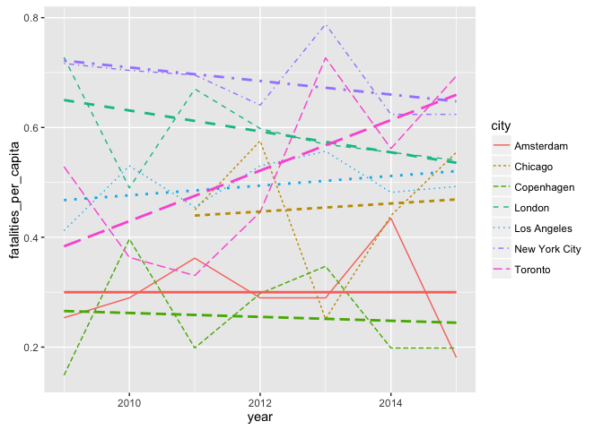
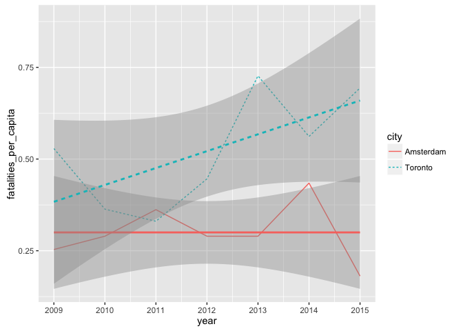

Road Safety
================
Ian Dennis Miller
July 13, 2016

Per Capita City
---------------

Fatality rates can be compared between cities by standardizing all fatalities according to city populations, yielding the per capita rate.

<!-- -->

Per Capita Metro
----------------

It is a common pattern for people to commute to cities during the workday even though they do not live in the city. On that basis, I have decided to use the Metro area population because I believe this will be a better indicator of the potential for road use. Larger metro areas will generate more trips, so it will be a better proxy for actual traffic and, therefore, opportunities for pedestrian and cyclist fatalities.

<!-- -->

Direct Comparison: NYC and Toronto
----------------------------------

<!-- -->

Direct Comparison: Amsterdam and Toronto
----------------------------------------

<!-- -->
