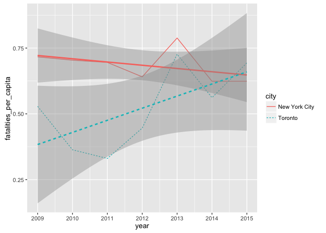

Road Safety
================
Ian Dennis Miller
July 13, 2016

Per Capita Metro
----------------

It is a common pattern for people to commute to cities during the workday even though they do not live in the city. On that basis, the Metro area population is used to ideally serve as a better indicator of road use. Larger metro areas will generate more trips, so it will be a better proxy for actual traffic and, therefore, opportunities for automobile, pedestrian, and cyclist interactions.

<!-- -->

Direct Comparison: NYC and Toronto
----------------------------------

95% confidence intervals have been added around the trend lines, enabling direct comparisons between cities.

In the case of New York City, we see that Toronto begins comparatively safer but quickly catches up. Although Toronto was significantly safer in 2009, the difference between the two cities becomes non-significant by 2013, and by 2015 Toronto actually surpasses New York in absolute terms (although the difference is still not significant).

The 7-year trend for New York is negative, whereas the 7-year trend for Toronto is positive. If these trends are extended just 2 or 3 years into the future, then we would expect to find that Toronto has become significantly more dangerous than New York City.

<!-- -->

Direct Comparison: Amsterdam and Toronto
----------------------------------------

Interestingly, in 2009 pedestrian and cyclist fatalities in Toronto were not significantly different from Amsterdam's rates. However, by 2011 Toronto did have significantly more fatalities and the gap appears to be widening. In contrast, Amsterdam appears to have a relatively constant rate of pedestrian and cyclist fatalities per capita.

<!-- -->
