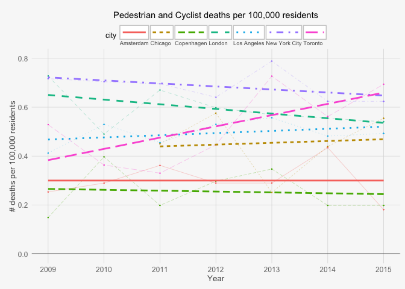
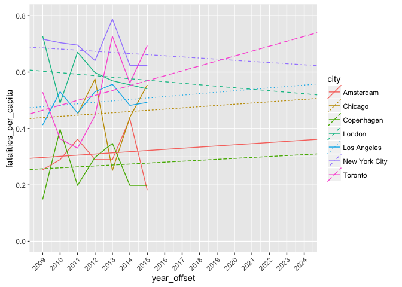
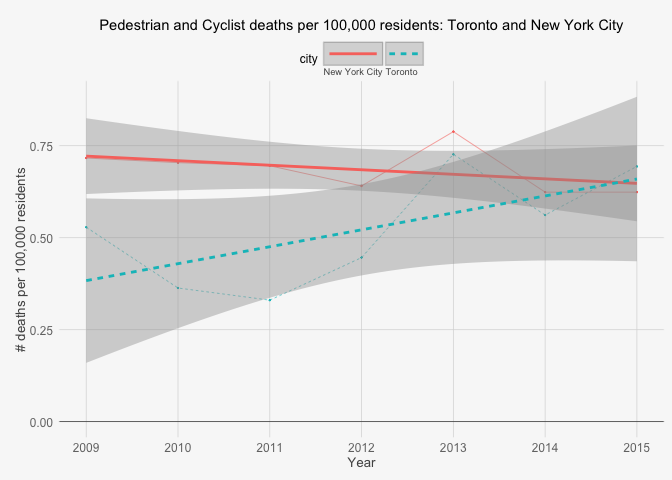
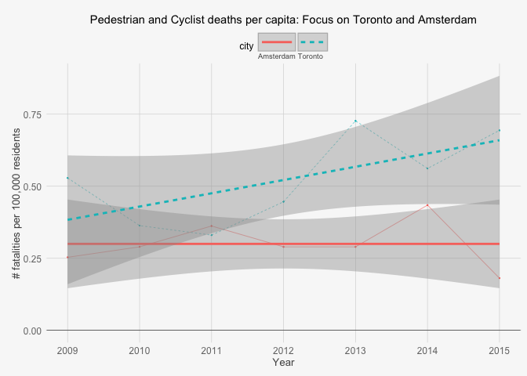

Road Safety in Toronto
================
Ian Dennis Miller
July 14, 2016

**DRAFT**

**This is not the final report.**

Introduction
------------

-   this report focuses on the city of Toronto
-   the main question is: are Toronto streets safe for pedestrians and cyclists?
-   it is difficult to characterize what "safety" even means
-   we can understand Toronto's relative safety by comparing to other cities
-   because many cities began recording cyclist and pedestrian fatalities online starting in the 2000s, it is possible to obtain longitudinal mortality data

Background
----------

Methods
-------

Toronto pedestrian and cyclist fatality data were collected for the 7-year period of 2009-2015. Similar data were collected for comparable cities:

-   New York City
-   Chicago
-   Los Angeles
-   London
-   Amsterdam
-   Copenhagen

Yearly *per capita* fatality rates were calculated based on Metro Area populations.

Results
-------

### Pedestrian and Cyclist Fatalities Per Capita

It is a common pattern for people to commute to cities during the workday even though they do not live in the city. On that basis, the Metro area population, rather than city population, is used as an indicator of road use. Larger metro areas will generate more trips, so it will be a better proxy for actual traffic and, therefore, opportunities for automobile, pedestrian, and cyclist interactions.

<!-- -->

### Trends

<!-- -->

### Direct Comparison: NYC and Toronto

95% confidence intervals have been added around the trend lines, enabling direct comparisons between cities.

In the case of New York City, we see that Toronto begins comparatively safer but quickly catches up. Although Toronto was significantly safer in 2009, the difference between the two cities becomes non-significant by 2013, and by 2015 Toronto actually surpasses New York in absolute terms (although the difference is still not significant).

The 7-year trend for New York is negative, whereas the 7-year trend for Toronto is positive. If these trends are extended just 2 or 3 years into the future, then we would expect to find that Toronto has become significantly more dangerous than New York City.

<!-- -->

### Direct Comparison: Amsterdam and Toronto

Interestingly, in 2009 pedestrian and cyclist fatalities in Toronto were not significantly different from Amsterdam's rates. However, by 2011 Toronto did have significantly more fatalities and the gap appears to be widening. In contrast, Amsterdam appears to have a relatively constant rate of pedestrian and cyclist fatalities per capita.

<!-- -->

Discussion
----------

This analysis suggests that in 2009 Toronto was one of the safer cities in the study. However, by 2015 Toronto had risen to the highest number of pedestrian and cyclist fatalities per capita among the 7 cities studied, and is trending to become significantly more dangerous than all other cities studied.

Conclusion
----------

References
----------

Appendix
--------

### Trend lines

|               |  intercept|       slope|
|---------------|----------:|-----------:|
| Amsterdam     |  0.2971794|   0.0040929|
| Chicago       |  0.4385113|   0.0043063|
| Copenhagen    |  0.2571088|   0.0033455|
| London        |  0.6031259|  -0.0053331|
| Los Angeles   |  0.4772473|   0.0051122|
| New York City |  0.6856390|  -0.0039906|
| Toronto       |  0.4646309|   0.0174627|

License
-------

[Creative Commons (CC BY-SA 4.0) 2016 Ian Dennis Miller](https://creativecommons.org/licenses/by-sa/4.0/)
